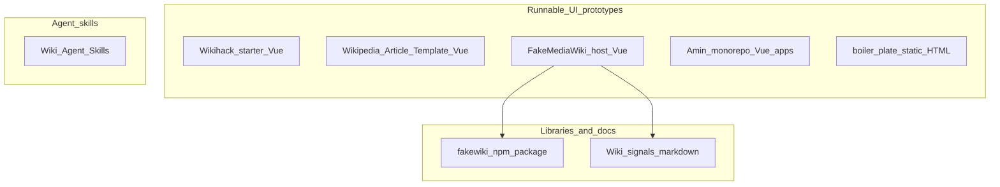

# Prior art: Wikimedia prototyping environments and related resources

This report summarizes publicly documented facts and repository-local documentation for the entries listed in [PRIOR_ART.md](PRIOR_ART.md), plus the **FakeMediaWiki** repository split into its host application, **Wiki signals** documentation, and the **`fakewiki`** package. **Amin’s monorepo** is described from a developer’s local clone path (`../amin-monorepo`); it is not linked publicly in PRIOR_ART.

Sources were checked against upstream READMEs and `package.json` files as of the date this file was generated. **Assessment** subsections interpret scope and mechanics using the cited documentation; they do not prescribe what any team should adopt next.

---

## 1. Wikihack starter

**Source:** [https://gitlab.wikimedia.org/egardner/wikihack-starter](https://gitlab.wikimedia.org/egardner/wikihack-starter)

### Documented facts

- **Positioning:** Described in the README as the “Wikipedia Reader Prototype Starter Kit”: a Vue 3 environment for experimenting with Wikipedia **reader** features, aimed at hackathons and rapid iteration, with minimal setup and testing UI ideas with real users.
- **Live content:** Fetches articles via Wikipedia’s REST API. The README lists:
  - Article content: `/api/rest_v1/page/html/{title}`
  - Search: `/w/api.php?action=opensearch`
  - Styling: `/w/load.php` (ResourceLoader)
- **Client-side only:** No backend; deployable as a static site.
- **Skins:** `src/config.js` exports `WIKI_LANG` (language code), `WIKI_SKIN` (`'desktop'` = Vector 2022, `'mobile'` = Minerva with collapsible sections), and `WIKI_SECTIONS_EXPANDED` (mobile-only, whether sections start expanded).
- **Dark mode:** `prefers-color-scheme: dark` and URL override `?color-mode=dark` (URL wins over system preference).
- **Design system:** [Codex](https://doc.wikimedia.org/codex/latest/) components and design tokens; [Less](https://lesscss.org/) for CSS preprocessing.
- **Project layout (README):** `src/components/` (AppHeader, AppFooter, ArticleSearch), `composables/useColorMode.js`, `services/wikipedia.js`, `views/` (HomeView, ArticleView), `App.vue`, `config.js`, `router.js`, `main.js`.
- **Extending:** New components in `src/components/`; article HTML rendered with class `.mw-parser-output`, with Less overrides in `App.vue` under that block.
- **Deployment:** `npm run build`, publish `dist/`; README documents Netlify (build `npm run build`, publish directory `dist`), Vercel (`vercel`), and GitHub Pages.
- **API etiquette:** README points to [API:Etiquette](https://www.mediawiki.org/wiki/API:Etiquette) and states a descriptive User-Agent is configured in `src/services/wikipedia.js`.
- **License:** MIT.
- **Demo:** Project page links to [https://wikihack-starter.netlify.app/](https://wikihack-starter.netlify.app/).

### Assessment

Reader-focused SPA: live HTML and ResourceLoader styling imply **network dependency** and alignment with production article rendering, at the cost of honoring public API usage expectations. Configurable language and desktop/mobile skins support cross-surface reader experiments without maintaining HTML snapshots.

---

## 2. Wikipedia Article Template

**Source:** [https://github.com/bmartinezcalvo/wikipedia-article-template](https://github.com/bmartinezcalvo/wikipedia-article-template)

### Documented facts

- **Positioning:** “Interactive UX prototype template for Wikipedia article pages,” Vue 3 and Wikimedia Codex. README states it **prioritizes design fidelity over production code quality** and targets UX testing and prototyping.
- **Modes:** **Read** (header with search, article layout, infobox, Vector 2022 TOC left / tools right, Minerva accordion layout, header skin switcher, responsive collapse from 1119px) and **Edit** (loading overlay with ProgressBar, toolbar, editable content with automatic change detection).
- **Content:** README directs editing article content in `src/components/WikipediaPage.vue` (sections, infobox, images such as `audreImage`). Sample asset `src/assets/lorde-1980.png` is mentioned.
- **Stack:** Vue 3 (Composition API), Codex, Vite, custom CSS (no Tailwind per README).
- **`codex-ux-prototyping-rules.md`:** States the project is for **design validation and usability testing**, not production code. Rules include: Codex as single source of truth; **Figma fidelity** as top priority; **no backend**, **no real APIs**, mock data and fake interactions; layout must match Figma/GIF; prefer Grid/Flexbox and simple boolean UI state.
- **Contributing / license:** README: “This template is for internal UX prototyping and testing.” Closing note: interactive prototype, not production code; **fake data** and simplified interactions for UX testing.
- **Repository extras:** Includes `.cursor` and `codex-ux-prototyping-rules.md` for agent/designer workflow.

### Assessment

Single-article, **mock-data** prototype: strong alignment with **controlled** UX studies and Figma-driven layout, with **no** dependency on live page fetch. Arbitrary-wiki-page coverage is not described as a goal; content is edited in source.

---

## 3. FakeMediaWiki — host application

**Source:** [https://github.com/todepond/fakemediawiki](https://github.com/todepond/fakemediawiki) (GitHub; README title is “FakeWiki”)

### Documented facts

- **Positioning (README):** “System for building lightweight MediaWiki prototypes”; includes Codex and CSS variables for wiki-like UIs; points to `packages/fakewiki` for MediaWiki APIs. Public demo: [https://todepond.github.io/FakeMediaWiki](https://todepond.github.io/FakeMediaWiki).
- **Documented stack (README):** Vue, Vite, Codex, GitHub Pages.
- **Root `package.json` (name `fake-mediawiki`):**
  - **Workspaces:** `packages/*`
  - **Engines:** `node` `^20.19.0 || >=22.12.0`
  - **Dependencies (representative):** `vue` `^3.5.26`, `vue-router` `^4.6.4`, `@wikimedia/codex` `^2.3.3`, `fakewiki` `workspace:*`, `d3`, `diff-match-patch`, `markdown-it`, etc.
  - **Scripts:** `dev` → `vite`; `build` → `vite build`; **`prebuild`** runs **`npm run generate`**; **`generate`** → **`npm run generate -w fakewiki`**, which executes the workspace package script in `packages/fakewiki` (`build-real-data-reference.mjs` at repo root + `scripts/generate-schema.ts` inside `fakewiki`); `publish` → `npm publish -w fakewiki --access public`; version bumps for `fakewiki` workspace; `lint`, `type-check` (`vue-tsc --noEmit`), `format`, `update-ve`.
- **Relationship:** Root app is a **consumer** of the workspace `fakewiki` package; **`npm run generate`** refreshes **Wiki signals**-derived reference output and **fakewiki** schema / reference artifacts before `vite build` (see §4–§5).

- **Prototype wrappers (layout shells):** The host app registers prototypes in [`src/prototypes/prototypes.ts`](https://github.com/todepond/fakemediawiki/blob/main/src/prototypes/prototypes.ts). Each runnable prototype has a **`wrapper`** id that selects which **shell layout** mounts the prototype. The `wrappers` array in that file defines five wrappers (id and human-readable `name`):
  - **`Special`** — “Special page”
  - **`Chrome`** — “Chrome”
  - **`Component`** — “Component”
  - **`Fullscreen`** — “Fullscreen”
  - **`Mobile`** — “Mobile”
  Vue Router maps these to paths in [`src/route.ts`](https://github.com/todepond/fakemediawiki/blob/main/src/route.ts): `/Special/:name`, `/Chrome/:name`, `/Fullscreen/:name`, `/Mobile/:name`, `/Component/:name` (plus `/` for the home view). [`vite.config.ts`](https://github.com/todepond/fakemediawiki/blob/main/vite.config.ts) generates **per-prototype HTML entry points** under `entry-points/<Wrapper>/<id>.html` from each prototype’s `wrapper` + `id`, so builds can address many prototype URLs as separate inputs. The same registry includes a **`wrappers`** category with **WrapperDemo** entries that document each layout (e.g. “Special page wrapper”, “Component wrapper”, “Fullscreen wrapper”, “Mobile wrapper”).

- **VisualEditor module (vendored + `lib/visualeditor/`):**
  - **Vendored assets:** Upstream **MediaWiki VisualEditor** is **not** an npm dependency of the app; instead, a built bundle is kept under **`public/ve/`** (served as static `/ve/...`). The root script **`npm run update-ve`** runs [`scripts/update-ve.sh`](https://github.com/todepond/fakemediawiki/blob/main/scripts/update-ve.sh), which either clones [wikimedia/VisualEditor](https://github.com/wikimedia/VisualEditor) (shallow) or uses a local clone path, runs `npm install` and `npx grunt build` in that tree, then copies **`dist`**, **`lib`**, and **`i18n`** into `public/ve/`.
  - **Loader and helpers:** [`lib/visualeditor/loadVe.ts`](https://github.com/todepond/fakemediawiki/blob/main/lib/visualeditor/loadVe.ts) injects the OOUI and VisualEditor CSS/JS chain from `/ve/` and exposes **`whenVeReady()`** (resolves when `window.ve` exists) and **`whenVePlatformReady()`** (initializes `ve.init.platform` / messages for features such as the diff view). Other files in the same folder (per repo layout) include **`veConversion.ts`**, **`veVisualDiff.ts`**, **`templateParamDiff.ts`**, **`veTypes.ts`**, and TypeScript shims **`ve.d.ts`**.
  - **Related library code:** [`lib/diffToVisualBlocks.ts`](https://github.com/todepond/fakemediawiki/blob/main/lib/diffToVisualBlocks.ts) lives alongside `lib/visualeditor/` and supports turning diff output into blocks for presentation (used with the VisualEditor-oriented flows in the app).
  - **Registered prototypes:** The same `prototypes.ts` registry lists multiple **“Visual editor”** category entries, including **`VisualEditorSandbox`** (“Embedded visual editor”, `Fullscreen`), **`VisualDiff`** (“Compare two snippets with the visual editor's diff view”, `Fullscreen`), and **`ExpandingWatchlistVisualDiff`** (“A feed of changes that shows visual inline diffs instead of wikitext diffs”, `Fullscreen`). **`VeSuggestions`** (“Edit suggestions”) is another editor-adjacent prototype under the dashboard category.

### Assessment

Monorepo **shell** that ships a demo site, wires Codex/wiki styling, and **builds** reference/playground artifacts alongside the publishable library. Scope is broader than a minimal reader starter (extra dependencies such as `d3`, `diff-match-patch`, `markdown-it` in root `package.json`). **Wrappers** are an explicit mechanism to reuse one prototype implementation inside different Wikipedia-like frames (special page vs chrome vs fullscreen vs mobile vs isolated component). **VisualEditor** support is a **large vendored submodule** of the repo (`public/ve/`), updated by a dedicated script from upstream VisualEditor, with TypeScript glue under `lib/visualeditor/` for loading and diff/editor experiments—not something the `fakewiki` npm package alone provides.

---

## 4. Wiki signals

**Source:** Same repository; directory **`real-data-signals/`** on disk. Index: [https://github.com/todepond/fakemediawiki/blob/main/real-data-signals/README.md](https://github.com/todepond/fakemediawiki/blob/main/real-data-signals/README.md)

### Documented facts

- **Title (README):** “Wiki signals”
- **Purpose:** “This folder contains guidance for using real MediaWiki data in prototypes.”
- **Files listed:**
  - `inference.md` — ML and related inference signals
  - `analytics.md` — analytics signals
  - `links.md` — getting links between pages
  - `curation.md` — curated content
- **Build integration:** Before `vite build`, root **`prebuild`** runs **`npm run generate`** → **`npm run generate -w fakewiki`**. The `fakewiki` workspace script ([`packages/fakewiki/package.json`](https://github.com/todepond/fakemediawiki/blob/main/packages/fakewiki/package.json)) runs `node ../../scripts/build-real-data-reference.mjs` (same **real-data-signals** pipeline as before) and `npx tsx scripts/generate-schema.ts` for schema / reference generation.

### Assessment

**Documentation-only** artifact inside the repo, not a separate runtime. It indexes **categories** of real data/signals engineers might use in prototypes; the build script ties that content into the project’s generated reference/playground pipeline.

---

## 5. FakeWiki (`fakewiki` npm package)

**Source:** `packages/fakewiki/` in [https://github.com/todepond/fakemediawiki](https://github.com/todepond/fakemediawiki); publishable as **`fakewiki`** on npm per README and root `publish` script.

### Documented facts

- **`package.json`:** `name` `fakewiki`, **`version` `0.0.11`** (from upstream at last check), `description` “Helpers for making MediaWiki prototypes”, **`license` `GPL-2.0-only`**, `repository.url` `https://github.com/todepond/FakeMediaWiki.git`, `type` `module`.
- **README (entry points):** The package README is short and points readers to hosted documentation instead of inlining the full API:
  - [API playground](https://todepond.github.io/FakeMediaWiki/Fullscreen/ApiPlayground) — try `FakeWiki` interactively.
  - [API reference page](https://todepond.github.io/FakeMediaWiki/Fullscreen/FakeWikiReference) — full **HTML** API reference in the demo app.
  - [**API reference markdown**](https://todepond.github.io/FakeMediaWiki/llms.txt) — a **markdown-style** export of the same reference (README labels it the “markdown version”; filename `llms.txt`), suitable for tools and agents that consume plain text.
- **README usage:** Minimal example: `import { FakeWiki } from "fakewiki"`, `new FakeWiki()`, `await wiki.getPage("Wet Leg")`. README states full documentation lives on the API reference page and that the markdown variant is available at `llms.txt`.
- **Package contents / publish set (`package.json` `files`):** `FakeWiki.ts`, `index.ts`, `types.ts`, `hooks/`, `style/`, `schema/`, `playground-schema.generated.ts`, `playground-overrides.ts`, **`AGENTS.md`**, `scripts/`.
- **`AGENTS.md`:** Large agent-oriented document in the package (listed in `files` for publication). It supplements the human/LLM-facing **markdown reference** pipeline.
- **Build / generation (`package.json` `scripts`):** `generate` runs `node ../../scripts/build-real-data-reference.mjs` then `npx tsx scripts/generate-schema.ts` — ties **Wiki signals**–style reference data and **schema generation** (playground / reference outputs) together. **DevDependencies** include **`markdown-it`**, **`markdown-it-anchor`**, and **`@types/markdown-it`**, consistent with generating or processing **markdown** documentation.
- **Exports (`package.json`):** `fakewiki`, `fakewiki/types`, `fakewiki/hooks`, `fakewiki/style/delta.css`, `fakewiki/playground-schema`, `fakewiki/playground-overrides` (unchanged in shape from earlier report versions; see upstream for exact map).
- **Peer dependencies (`package.json`):** `vue` `^3.5.0`, `@wikimedia/codex-icons` `^2.0.0`.
- **`docs/` (in-repo markdown):** Includes, among others, `CODEX_REFERENCE.md`, `ICON_REFERENCE.md`, `CODEX_ICONS_IN_REPO.md`, `VE_SUGGESTION_TYPES_REPORT.md`, and **`ENWIKI_TEXTMATCH_REFERENCE.md`** plus **`ENWIKI_TEXTMATCH_LLM_TERMS.json`** (additional reference material shipped beside the generated site).
- **External links (README):** [Wikimedia REST API](https://www.mediawiki.org/wiki/Wikimedia_REST_API), [MediaWiki REST API](https://www.mediawiki.org/wiki/API:REST_API), [MediaWiki Action API](https://www.mediawiki.org/wiki/API:Main_page).
- **Install:** `npm install fakewiki` (README).

### Assessment

**Reusable library** decoupled from the host demo: can be imported into other Vue 3 prototypes. Upstream has moved **detailed method and hook documentation** out of the README into a **dedicated API reference** (HTML + **`llms.txt` markdown**), with **`AGENTS.md`** and **`docs/*.md`** as additional in-repo references, and a **`generate`** script that rebuilds schema/reference artifacts using **markdown tooling**. Functionally the client still targets the same public Wikimedia/MediaWiki HTTP APIs; the change is primarily **documentation delivery** and **reference generation**, not a different runtime model than a minimal REST fetch.

---

## 6. Amin’s monorepo (`wikimedia-prototypes`)

**Source:** Local path referenced in PRIOR_ART: `../amin-monorepo` (private; not publicly linked). Facts below are taken from that clone’s `package.json` and `CLAUDE.md` files.

### Documented facts

- **Workspace name:** `wikimedia-prototypes` (`package.json`); **package manager:** `pnpm@10.32.1`.
- **Root scripts and ports (`package.json`):**
  - `pnpm account-creation` → Vite on port **5203**
  - `pnpm article-guidance-nve` → **5204**
  - `pnpm article-creation` → **5205**
  - `pnpm boilerplate` → **5206**
  - `pnpm account-creation-v3` → **5207**
  - `pnpm -F <name> build` documented for production builds
  - `./new-prototype.sh <name>` to create a new app from boilerplate
- **Layout (`CLAUDE.md`):** `apps/` holds one prototype per directory; **`packages/shared`** is **`@wm/shared`**; **apps cannot import each other**.
- **Shared package responsibilities:** `WikipediaHeader.vue`, `WikipediaFooter.vue`, `AdminPanel.vue` (generic shell), `useSettings.ts` (URL query ↔ settings sync), `global.css` base — README rules say not to duplicate header/footer locally; promote duplicated logic to shared when it appears in two or more apps.
- **Boilerplate (`apps/boilerplate/CLAUDE.md`):** Described as a **frozen template** — only change to update the starting point for future prototypes; **not** to be used as the working prototype. New work: `./new-prototype.sh <name>` then `apps/<name>/src/views/HomeView.vue`.
- **Tech (boilerplate `CLAUDE.md`):** Vue 3 + Vite + TypeScript strict; Codex + Codex icons; ESLint + Oxlint + Prettier; `App.vue` provides Admin panel toggle; **Ctrl+Shift+S** opens admin; TipTap suggested for rich text with examples in `article-creation` / `article-guidance-nve`.
- **Settings:** `useSettings` keeps only non-default values in the URL; documented pattern for booleans, strings, numbers.
- **Deployment:** Root `CLAUDE.md` documents **Vercel** per-app deployment (root directory = app folder, include files outside root, `vercel.json` uses `npx pnpm install`).

### Assessment

**Multi-app monorepo** with explicit **governance** (shared chrome, URL-shareable settings, no cross-app imports). Documented cost: monorepo and pnpm conventions; documented benefit: repeated Wikipedia shell and admin/settings patterns across many experiments.

---

## 7. Wiki Agent Skills (Wiki Skills)

**Source:** [https://gitlab.wikimedia.org/santhosh/wiki-skills](https://gitlab.wikimedia.org/santhosh/wiki-skills)

### Documented facts

- **Positioning:** “A collection of skills for AI coding agents focused on Wikimedia projects,” packaged as instructions extending agents for Wikipedia, Wikidata, MediaWiki, and Wikimedia design systems.
- **Format:** Follows [https://agentskills.io/](https://agentskills.io/).
- **Skills listed in README:**
  - `wikipedia-editor-research` — draft articles with Wikitext, citations, NPOV
  - `wikidata-natural-query` — natural language Wikidata queries
  - `wikipedia-rest-api` — REST API guide with multi-language code generation
  - `mediawiki-database-tables` — schema and query patterns
  - `mediawiki-extension-development` — extensions through deployment
  - `codex-design-tokens` — UIs with Codex tokens
  - `wikimedia-gerrit` — Gerrit workflow with git-review/SSH
- **Installation:** `npx skills add git@gitlab.wikimedia.org:santhosh/wiki-skills.git`
- **Skill layout:** Each skill has `SKILL.md`; optional `references/`, `assets/`.
- **License:** MIT.

### Assessment

**Not a runnable web prototype:** it is an **agent capability pack**. It intersects thematically with UI prototyping (e.g. Codex tokens skill) but does not host static or SPA demos by itself.

---

## 8. Wikipedia UX Prototyping System (`boiler_plate`)

**Source:** [https://github.com/Sudhanshugtm/boiler_plate](https://github.com/Sudhanshugtm/boiler_plate)

### Documented facts

- **Positioning:** “Rapid prototyping framework for Wikipedia UX design work”; README markets fetch-any-page workflows, local interactivity, URL variants, GitHub Pages sharing, multi-language.
- **Fetcher:** `python3 fetch_page.py` with `--url` or `--lang` + `--page`; outputs under `pages/`. Quick start uses e.g. Hindi Special:Contribute URL.
- **Static tree (README):** `fetch_page.py`, `index.html`, `pages/`, `assets/css/` (vendored Wikipedia CSS), `assets/js/` (`variants.js`, `dropdowns.js`, `tabs.js`, `search.js`, `main.js`), `WORKFLOW.md`, `DEPLOYMENT.md`.
- **Visual editor prototype:** README §1.5 — open via Edit links or `?editor=1`; toolbar (bold/italic/headings/link/cite/media), contenteditable, source toggle, autosave drafts, mock publish with word-level diff preview; `assets/js/editor.js`, `assets/css/editor.css` (fetcher injects as documented).
- **Variants:** `?variant=1|2|3`, `?debug=true`, in-page **⚙** switcher; README describes adding `variant-N` class on `body` for CSS, variant indicator, console logging.
- **Deployment:** GitHub Actions deploy to GitHub Pages on push to `main`; README Settings → Pages → source **GitHub Actions**; manual workflow dispatch mentioned.
- **Limitations (README):** No backend; search not connected to real Wikipedia search; edit/save does not persist; navigation requires fetching each page individually; described as intentional for UX prototyping.
- **License (README):** Wikipedia content CC BY-SA 4.0; MediaWiki software GPL-2.0-or-later; “This prototyping system” GPL-2.0-or-later.
- **Attribution:** README closing: “Built for rapid Wikipedia UX prototyping by Wikimedia UX designers.”

### Assessment

**Snapshot pipeline:** production HTML/CSS/JS copied locally, with Python as a **one-shot** importer. Overlaps with live-API readers in **surface realism** (real layout/CSS) but uses **static files** after fetch; README explicitly caps fidelity of search and save behaviors.

---

## Cross-cutting comparison

### Observable groupings

### Attribute table (from each project’s docs / manifests)

| Name | Author (maintainer / org) | Host / URL | Primary artifact | Data for UI | Codex | Typical deploy (documented) | License (documented) |
|------|----------------------------|------------|------------------|-------------|-------|---------------------------|----------------------|
| Wikihack starter | Eric Gardner (`egardner`) | WMF GitLab | Vue 3 SPA | Live REST HTML, opensearch, ResourceLoader | Yes | Netlify, Vercel, GitHub Pages | MIT |
| Wikipedia Article Template | bmartinezcalvo | GitHub | Vue 3 SPA | Mock / hand-authored in Vue | Yes | Local `npm run dev` (static build via Vite implied) | README: internal UX prototyping/testing |
| FakeMediaWiki host | todepond | GitHub | Vue 3 SPA + workspace | Uses `fakewiki` (live APIs per package README) | Yes | GitHub Pages demo URL in README | Repository root `LICENSE` is GNU General Public License Version 2 text |
| Wiki signals | todepond (same repo as host) | GitHub (folder) | Markdown guides | N/A (reference only) | N/A | N/A (built into host `prebuild`) | Same repo as host |
| `fakewiki` | todepond (`packages/fakewiki`) | npm + GitHub workspace | TypeScript / Vue library; API reference (HTML + markdown `llms.txt`) | Live APIs (per reference / `FakeWiki`) | Peer: codex-icons | Consumed by apps; `npm publish` in root scripts | GPL-2.0-only |
| Amin monorepo | Amin (private; see [PRIOR_ART.md](PRIOR_ART.md)) | Private clone | pnpm monorepo, multiple Vite apps | App-dependent (not uniform in root docs) | Yes | Vercel per app in `CLAUDE.md` | Not stated in excerpts used |
| Wiki Agent Skills | Santhosh (`santhosh`) | WMF GitLab | Agent Skills bundles | N/A | Skill: codex-design-tokens | `npx skills add …` | MIT |
| Wikipedia UX Prototyping System | Sudhanshugtm | GitHub | Python fetch + static HTML/JS | Fetched Wikipedia pages | Not positioned as Codex-first | GitHub Actions → Pages | README: framework GPL-2.0-or-later |

### Overlaps (descriptive)

- **Wikihack starter**, **FakeMediaWiki/`fakewiki`**, and **boiler_plate** all target **real Wikipedia content or chrome**; the first two emphasize **ongoing** API or library access, the third emphasizes **frozen** HTML/CSS snapshots after `fetch_page.py`.
- **Wikipedia Article Template** and **Amin monorepo** both use **Vue + Codex**; the template centers on a **single article** with mock data, while the monorepo documents **many apps** sharing header/footer and URL settings.
- **Wiki signals** and **`fakewiki`** both relate to **real MediaWiki data**, but signals are **narrative/reference**, whereas `fakewiki` is **executable client code**.
- **Wiki Agent Skills** overlaps **topically** with several stacks (REST API, Codex, extensions) but is **orthogonal** to hosting a clickable prototype.

---

## References

- [PRIOR_ART.md](PRIOR_ART.md) — original list of links and local paths.
- Upstream READMEs and `package.json` files as cited per section.
